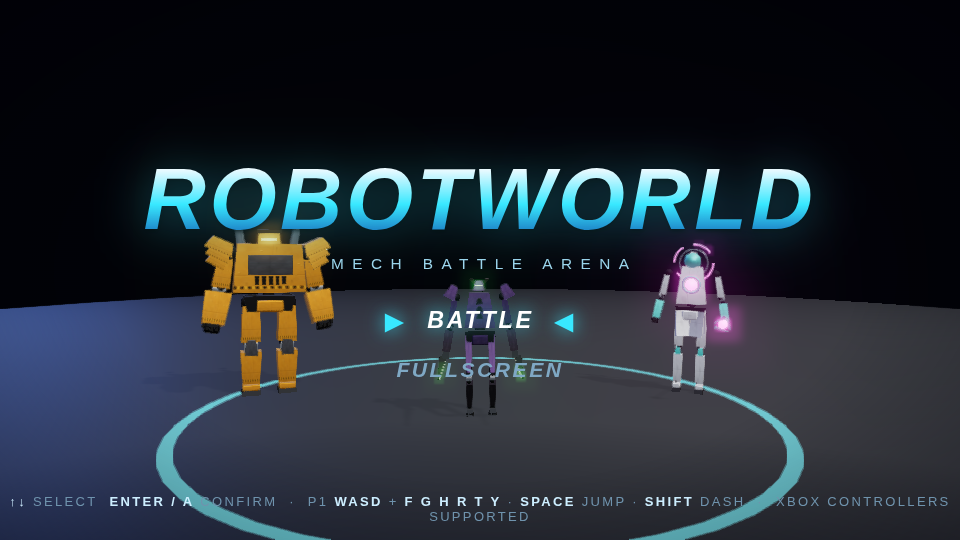
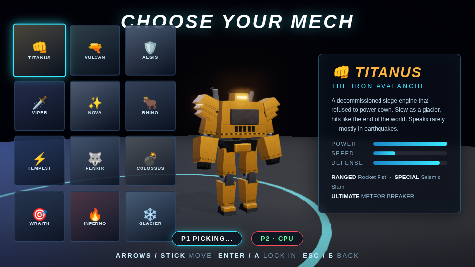
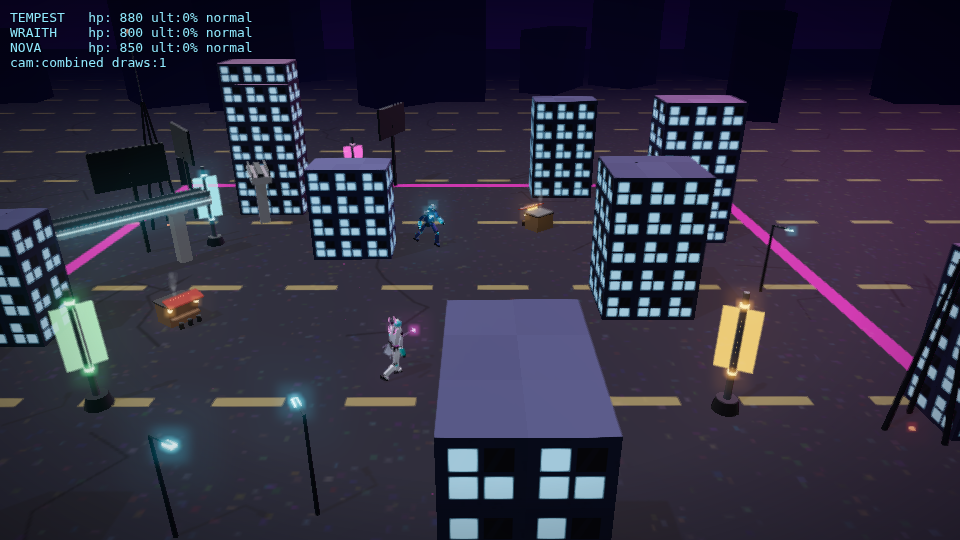
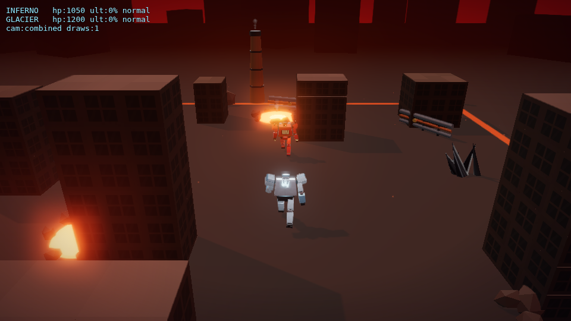
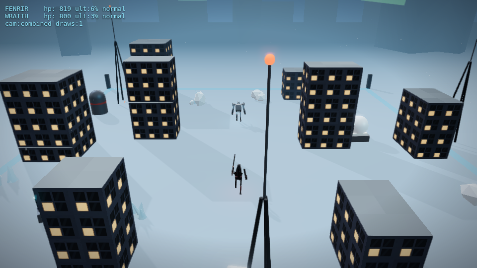
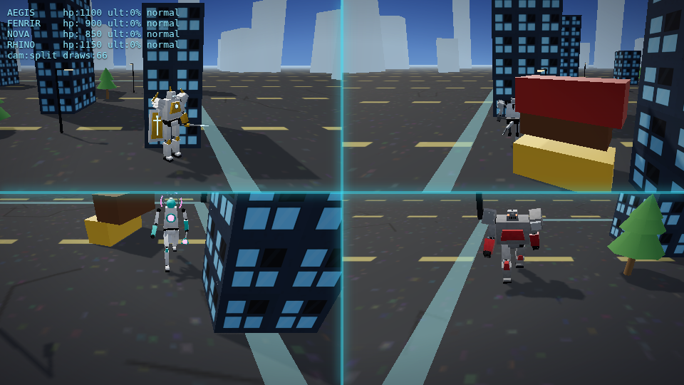

# 🤖 ROBOTWORLD — Mech Battle Arena

A fully featured browser-based 3D mech arena fighter in the spirit of
*Override: Mech City Brawl*. **12 unique mechs**, **12 destructible city
arenas**, local multiplayer for up to **4 players** (keyboard + Xbox
controllers), and AI opponents across three difficulty tiers.

Everything — 3D models, textures, animation, VFX, music and sound — is
generated procedurally in code. No asset files, no downloads.




| | |
|---|---|
|  |  |
|  |  |

## Running the game

```bash
npm install
npm run dev        # → http://localhost:5173
```

Production build: `npm run build`, then `npm run preview` (or serve `dist/`).

Best experienced in Chrome/Edge fullscreen (F10 or the title-menu option).

## The Roster

| Mech | Role | Ranged | Special | Ultimate |
|------|------|--------|---------|----------|
| 👊 **TITANUS** | Colossal brawler | Rocket Fist | Seismic Slam | METEOR BREAKER |
| 🔫 **VULCAN** | Gatling gunner | Gatling Burst | Micro-Missile Volley | BULLET HURRICANE |
| 🛡️ **AEGIS** | Shield paladin | Lance Wave | Bulwark Bash | JUDGMENT RAY |
| 🗡️ **VIPER** | Blade assassin | Venom Dart | Phantom Strike | SERPENT STORM |
| ✨ **NOVA** | Plasma caster | Plasma Lance | Starfall Trio | SUPERNOVA |
| 🐂 **RHINO** | Charging bull | Shoulder Cannon | Bull Rush | STAMPEDE |
| ⚡ **TEMPEST** | Storm dancer | Arc Bolt | Static Overload | THUNDERFALL |
| 🐺 **FENRIR** | Feral hunter | Rend Wave | Lunar Pounce | WILD HUNT |
| 💣 **COLOSSUS** | Walking artillery | Mortar Lob | Fire Mission | BIG BERTHA |
| 🎯 **WRAITH** | Stealth sniper | Longshot | Ghost Protocol | DEADEYE |
| 🔥 **INFERNO** | Flame juggernaut | Dragon's Breath | Napalm Carpet | BACKDRAFT |
| ❄️ **GLACIER** | Cryo fortress | Shard Burst | Cryo Beam | ABSOLUTE ZERO |

Every mech has a full move set: 3-hit light combo, heavy launcher, ranged
weapon, dodge-dash with i-frames, block, taunt, a cooldown special and an
ultimate charged by dealing/taking damage.

## Controls

| Action | Keyboard P1 | Keyboard P2 | Xbox Controller |
|--------|-------------|-------------|-----------------|
| Move | WASD | Arrows | Left stick |
| Jump | Space | Numpad 0 | A |
| Light attack | F | Numpad 1 | X |
| Heavy attack | G | Numpad 2 | Y |
| Block | H | Numpad 3 | LT |
| Ranged | R | Numpad 4 | RT |
| Special | T | Numpad 5 | B |
| Ultimate | Y | Numpad 6 | LB |
| Dash | Shift | Numpad Enter | RB |
| Taunt | B | Numpad . | R-stick click |
| Pause | Esc / P | — | Start |

Controllers hot-plug: connect any time; assign them on the Battle Setup
screen. Rumble is supported where the browser allows it.

## Features

- **Destructible arenas** — chunk-based buildings shear apart under fire,
  cascade-collapse when their support is destroyed, and shower ballistic
  debris. Launch an enemy through a facade. 12 themed arenas from a neon
  downtown to a steampunk foundry to an orbital platform.
- **LEGO-style dynamic camera** — one cinematic combined view while fighters
  are close; splits into per-player chase viewports when they separate,
  and merges back with hysteresis.
- **Local multiplayer** — up to 4 fighters in free-for-all: any mix of
  keyboards, Xbox controllers and AI (Rookie / Veteran / Ace).
- **Match flow** — best-of-3 rounds, intros, KO slow-mo, victory poses,
  damage popups, ult callouts, round timer.
- **Procedural everything** — PBR-shaded mechs assembled from a parts kit,
  canvas-painted textures, pose-blend animation engine, synthesized SFX and
  a step-sequenced soundtrack (menu + 3 battle themes).

## Dev shortcuts

- `?showcase` — all 12 mechs idle line-up · `?showcase=<id>` — clip cycler
- `?showcase=all&anim=walk` — locomotion test
- `?battle=<themeId>&p1=<mech>&p2=<mech>[&p3=..][&p4=..][&auto=1][&diff=ace]`
  — jump straight into a fight (auto=1: all-AI soak test)

## Mech art pipeline

Turn a concept image into a rigged, animated in-game mech — two routes
(external image→3D services, or the free in-engine sculpted pipeline) —
fully documented for future contributors (human or AI) in
[docs/MECH_ART_GUIDE.md](docs/MECH_ART_GUIDE.md).

## Task tracking

Build progress and the full phase plan live in [TASKS.md](TASKS.md).
